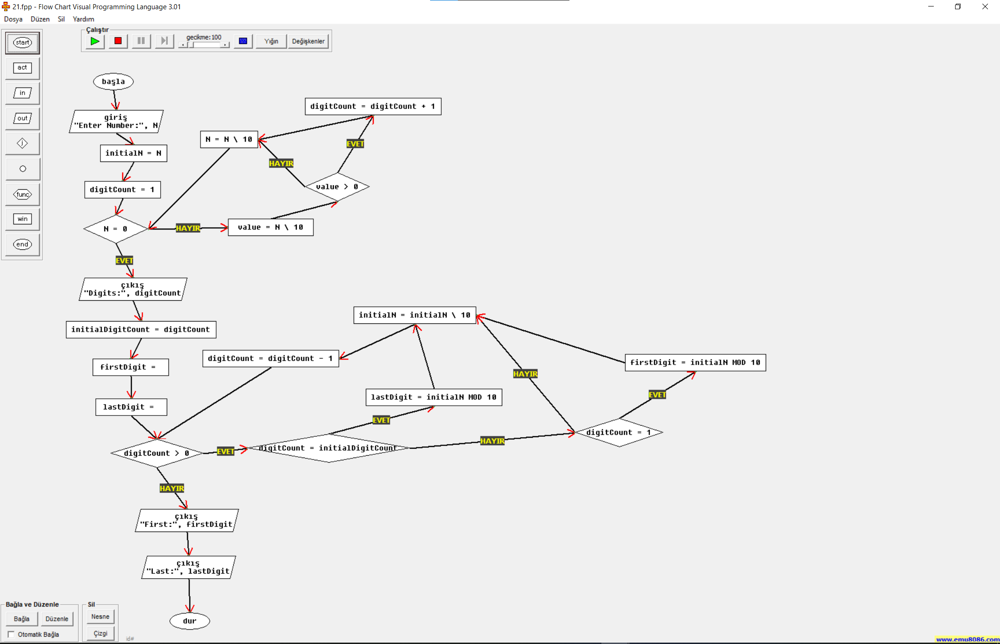

# Mustafa Eren Hızarcı

### Student Number: 2110213018

# Programming Languages I (CPE101) Homeworks

I used the Flow Chart Visual Programming Language Windows Application for make these flowcharts because in this app you can run and test your flowchart
in console. `Or you can simply look screenshots folder in this repository`

You can download it from here: [Flowchart Visual Programming Language](https://drive.google.com/file/d/1trKgr23QLZc89yfEtpfQ9H-EsG47yRX7/view?usp=sharing)

